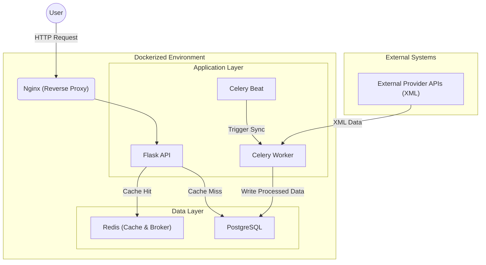

# Scalable Event Aggregator Microservice

[](https://www.python.org)
[](https://flask.palletsprojects.com/)
[](tests/)
[](https://www.docker.com/)
[](https://docs.celeryq.dev/)
[](https://www.postgresql.org/)

## 🚀 Overview

This project is a production-ready microservice designed to **aggregate, normalize, and serve event data** from disparate external XML API providers.

It acts as a robust **Anti-Corruption Layer** that insulates internal systems from the inconsistencies and failures of external third-party APIs. Engineered to **ingest thousands of complex XML events via background workers** without impacting API latency, it ensures <50ms response times even during heavy data synchronization.

**Key Capabilities:**

- **Resilience**: Decouples internal reads from external provider failures. If a provider goes down, the API continues to serve cached/stored data.
- **High Performance**: Optimized for read-heavy workloads using multi-layer caching (Redis) and efficient database indexing.
- **Data Integrity**: Parses and validates "dirty" XML data into strict Pydantic models before storage.
- **Scalability**: Uses background workers (Celery) to handle data ingestion without blocking the main API thread.

---

## 🏗️ Architecture

The system follows a **Clean Architecture** approach, separating business logic, data access, and external integrations.



For a detailed deep-dive into the architectural decisions, design patterns (Repository, Adapter), and scalability strategies, please see the **[Design & Scalability Report](docs/DESIGN_AND_SCALABILITY.md)**.

---

## 🛠️ Tech Stack

- **Core**: Python 3.11+, Flask, APIFairy (OpenAPI/Swagger).
- **Data**: SQLAlchemy (ORM), Pydantic (Validation), PostgreSQL 15.
- **Async & Caching**: Celery, Redis.
- **Infrastructure**: Docker, Docker Compose, Nginx.
- **Testing**: Pytest, Factory Boy, lxml (for parsing).

---

## ⚡ Quick Start

Prerequisites: `Docker` and `Make`.

### 1. Run the System

The entire environment (API, DB, Redis, Worker, Nginx) is containerized.

```bash
# Build and start services
make build
make up
```

The API will be available at **`http://localhost:8080`**.

### 2. Verify Health

```bash
curl http://localhost:8080/v1/health
# {"status": "ok"}
```

### 3. Run Tests

Execute the comprehensive test suite (Unit + Integration) in an isolated container.

```bash
make test
```

---

## 🔌 API Usage

### Search Events

Retrieve events within a specific date range.

```bash
curl -X GET "http://localhost:8080/v1/events/search?starts_at=2024-01-01T00:00:00Z&ends_at=2024-12-31T23:59:59Z"
```

**Response Example:**

```json
{
  "data": {
    "events": [
      {
        "id": "291",
        "title": "Camellias @ 12:00 PM",
        "start_date": "2024-07-04",
        "start_time": "12:00:00",
        "end_date": "2024-07-04",
        "end_time": "13:00:00",
        "min_price": 20.0,
        "max_price": 35.0
      }
    ]
  },
  "error": null
}
```

---

## 🔍 Technical Highlights

### 1. Asynchronous Ingestion Strategy

Instead of fetching data from providers on-demand (which is slow and unreliable), this system uses a **background synchronization pattern**.

- **Celery Beat** schedules periodic sync tasks.
- **Celery Workers** fetch and parse XML from providers in parallel (extensible).
- **Atomic Upserts** ensure data consistency in the database, handling updates for existing records and correctly marking "stale" data that is no longer present in the provider's feed.

### 2. Resilient XML Parsing

External data is often messy. The `XMLParser` component uses `lxml` for speed and Pydantic for validation, ensuring that only valid, well-structured data reaches the database.

- **Granular Error Handling**: Malformed zones or plans are skipped individually without crashing the entire file processing.
- **Normalization**: Flattens nested XML structures into relational database tables (`Events`, `Plans`, `Zones`).

### 3. Caching & Performance

- **API Level**: Endpoints are cached using Redis to serve frequent search queries instantly.
- **Database Level**: Indexed columns on `start_date` and `end_date` optimize range queries. `joinedload` strategies are used to prevent N+1 query problems when fetching related plans and zones.

### 4. Developer Experience (DX)

- **Makefile** interfaces for all common tasks.
- **Auto-Migrations** via Alembic/Flask-Migrate on container startup.
- **Structured Logging** for easier debugging in production.

---

## 📜 License

This project is open-source and available under the MIT License.
